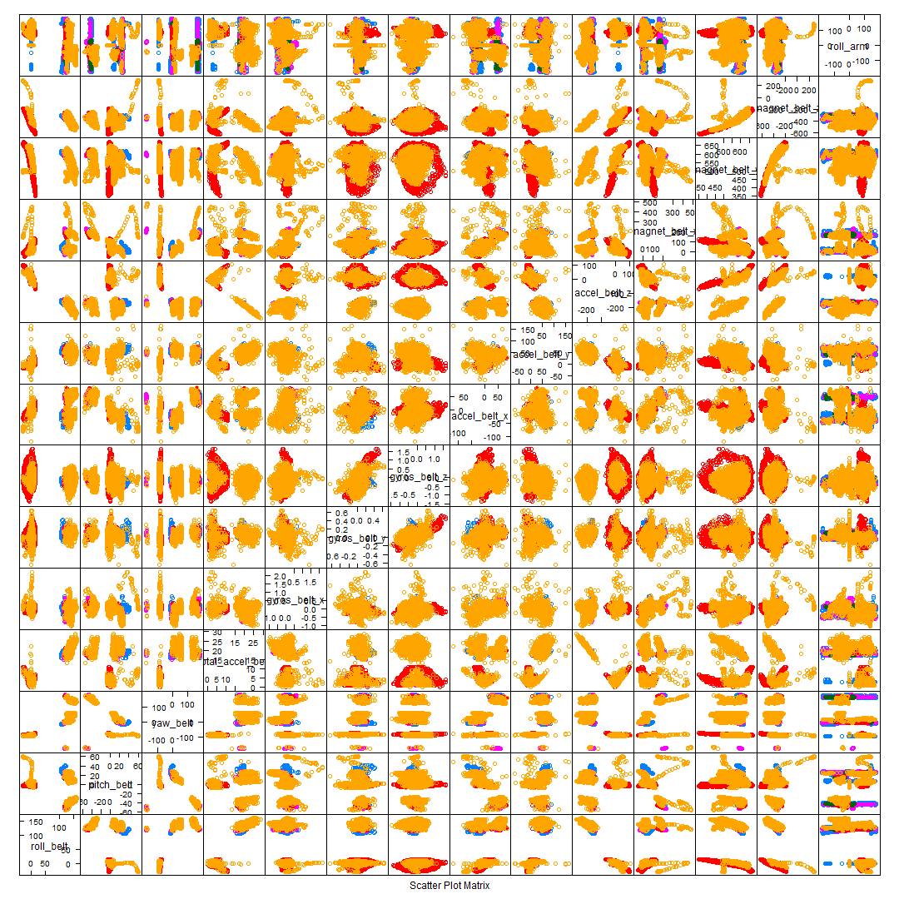
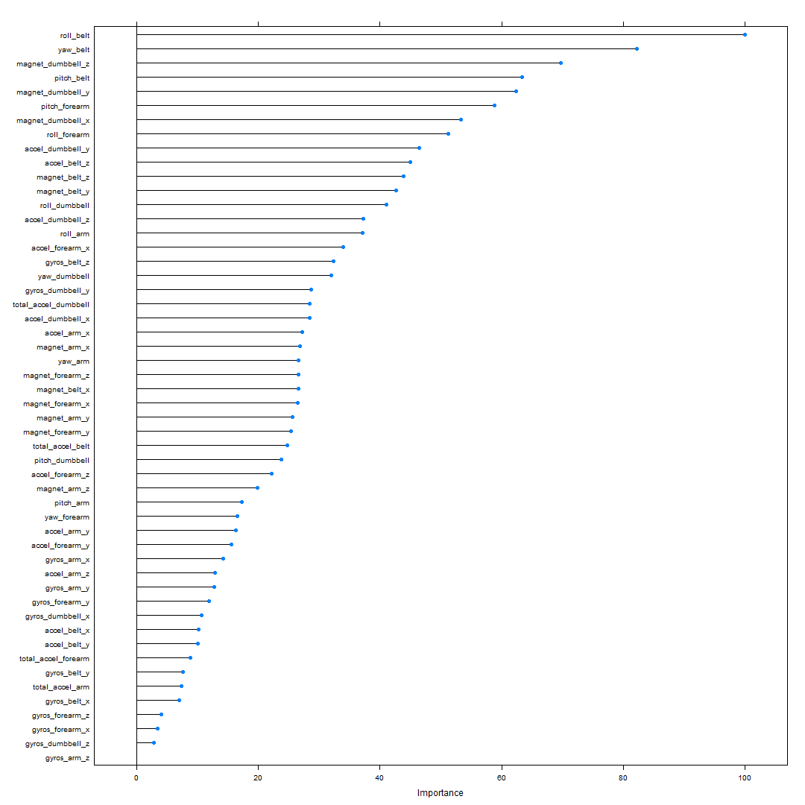

---
title: "Developing Data Products Course Project"
author: "Yoseph Mekasha Akalemariam"
date: "October 14, 2014"
output: html_document
---  


 
## Introduction
 
<p style="text-align:justify">Human Activity Recognition - HAR - has emerged as a key research area in the last years and is gaining increasing attention by the pervasive computing research community, especially for the development of context-aware systems. There are many potential applications for HAR, like: elderly monitoring, life log systems for monitoring energy expenditure and for supporting weight-loss programs, and digital assistants for weight lifting exercises.Using devices such as Jawbone Up, Nike FuelBand, and Fitbit it is now possible to collect a large amount of data about personal activity relatively inexpensively.</p>

One thing that people regularly do, using these devices, is quantify how much of a particular activity they do, but they rarely quantify how well they do it. **The goal of this project is to predict the manner in which users of these devices did their exercise.**

## Methodology

### Data

The training and test data are provided  in the following links respectivly. [training data][1], [test data][2]. The [original data][3] come from [Groupware][4].

[1]: https://d396qusza40orc.cloudfront.net/predmachlearn/pml-training.csv
[2]: https://d396qusza40orc.cloudfront.net/predmachlearn/pml-testing.csv
[3]: http://groupware.les.inf.puc-rio.br/har
[4]: http://groupware.les.inf.puc-rio.br

```r
# getting training data
if (!file.exists("data/pml-training.csv")) {
  download.file("https://d396qusza40orc.cloudfront.net/predmachlearn/pml-training.csv", 
              destfile="data/pml-training.csv", method="auto")
}

training <- read.csv("data/pml-training.csv", na.strings = c("", "NA", "#DIV/0!"), stringsAsFactors = TRUE )
dim(training)
#summary(training)

#getting test data
if (!file.exists("data/pml-testing.csv")) {
  download.file("https://d396qusza40orc.cloudfront.net/predmachlearn/pml-testing.csv", 
              destfile="data/pml-testing.csv", method="auto")
}

testing  <- read.csv("data/pml-testing.csv", na.strings = c("","#DIV/0!"), stringsAsFactors = TRUE )
#dim(testing)
```


### Exploratory Analysis
A quick review of the training data shows that some variables carry a lot of missing values and there are also some character variables highly co-related to  classe(See the plot in ** Annex 1** section), thus would lead to overfitting. The following r code section removes these columns.


```r
# removing Character variables to avoid overfitting.
training<- training[,!(names(training) %in% c("X","V1", "user_name", "raw_timestamp_part_1", "raw_timestamp_part_2", "cvtd_timestamp", "new_window", "num_window"))]
# removing summary columns (with almost all NA values)
training <-training[,colSums(is.na(training)) == 0]
```
Now that we have a clean test data, let us partion on *classe* with 70%, 30%  into test and validation portions respectivly.

```r
library(caret)
#Splitting into training and validation sets

index <- createDataPartition(training$classe, p=.7, list=FALSE)
training.train <-training[index,]
training.validate <- training[-index,]
dim(training.train)
```

```
## [1] 13737    53
```

```r
dim(training.validate)
```

```
## [1] 5885   53
```


### Statistical Modeling
Further explorary analysis shows custers leading which earges one to select Random forests model.


```r
training.train$classe <- as.factor(training.train$classe)
training.validate$classe <-as.factor(training.validate$classe)

model <- train(classe~ .,data = training.train)
summary(model)
```

```
##                 Length Class      Mode     
## call                4  -none-     call     
## type                1  -none-     character
## predicted       13737  factor     numeric  
## err.rate         3000  -none-     numeric  
## confusion          30  -none-     numeric  
## votes           68685  matrix     numeric  
## oob.times       13737  -none-     numeric  
## classes             5  -none-     character
## importance         52  -none-     numeric  
## importanceSD        0  -none-     NULL     
## localImportance     0  -none-     NULL     
## proximity           0  -none-     NULL     
## ntree               1  -none-     numeric  
## mtry                1  -none-     numeric  
## forest             14  -none-     list     
## y               13737  factor     numeric  
## test                0  -none-     NULL     
## inbag               0  -none-     NULL     
## xNames             52  -none-     character
## problemType         1  -none-     character
## tuneValue           1  data.frame list     
## obsLevels           5  -none-     character
```

## Result
Let us now observe the error rate using both calculating cross validation and confusion matrix .


```r
#Cross-validation
missing <- function(trueValues, predictedValue){
  sum(predictedValue != trueValues)/length(trueValues)
}
missing(training.train$classe, predict(model, training.train))
```

```
## [1] 0
```

```r
error<-missing(training.validate$classe, predict(model, training.validate))

#confusion Matrix
confusionMatrix(predict(model,
                        newdata=training.validate),
                training.validate$classe
                )
```

```
## Confusion Matrix and Statistics
## 
##           Reference
## Prediction    A    B    C    D    E
##          A 1674    6    0    0    0
##          B    0 1131   11    0    0
##          C    0    2 1013   26    0
##          D    0    0    2  938    5
##          E    0    0    0    0 1077
## 
## Overall Statistics
##                                         
##                Accuracy : 0.991         
##                  95% CI : (0.988, 0.993)
##     No Information Rate : 0.284         
##     P-Value [Acc > NIR] : <2e-16        
##                                         
##                   Kappa : 0.989         
##  Mcnemar's Test P-Value : NA            
## 
## Statistics by Class:
## 
##                      Class: A Class: B Class: C Class: D Class: E
## Sensitivity             1.000    0.993    0.987    0.973    0.995
## Specificity             0.999    0.998    0.994    0.999    1.000
## Pos Pred Value          0.996    0.990    0.973    0.993    1.000
## Neg Pred Value          1.000    0.998    0.997    0.995    0.999
## Prevalence              0.284    0.194    0.174    0.164    0.184
## Detection Rate          0.284    0.192    0.172    0.159    0.183
## Detection Prevalence    0.285    0.194    0.177    0.161    0.183
## Balanced Accuracy       0.999    0.995    0.991    0.986    0.998
```

```r
confusionMatrix(predict(model, newdata=training.validate),training.validate$classe)$overall["Kappa"]
```

```
##  Kappa 
## 0.9888
```

<p style="text-aligh:justify">The error rate from the cross-validation calculation is about 0.8836 Percent While the out of sample error from the Kappa statistic of the confusion matrix is  0.9888. Variable importance plot has also been included in **Annex 2**.</p>


## Concution

The error rates are acceptable, this mean our model is good enough.


## References

1. Training data : https://d396qusza40orc.cloudfront.net/predmachlearn/pml-training.csv
2. Test data: https://d396qusza40orc.cloudfront.net/predmachlearn/pml-testing.csv
3. Original data source: http://groupware.les.inf.puc-rio.br/har

## Annex

```r
library(ggplot2)
featurePlot(x=training[,c(1:14)], y=training$class, plot="pairs")
```

 


```r
plot(varImp(model))
```

 
